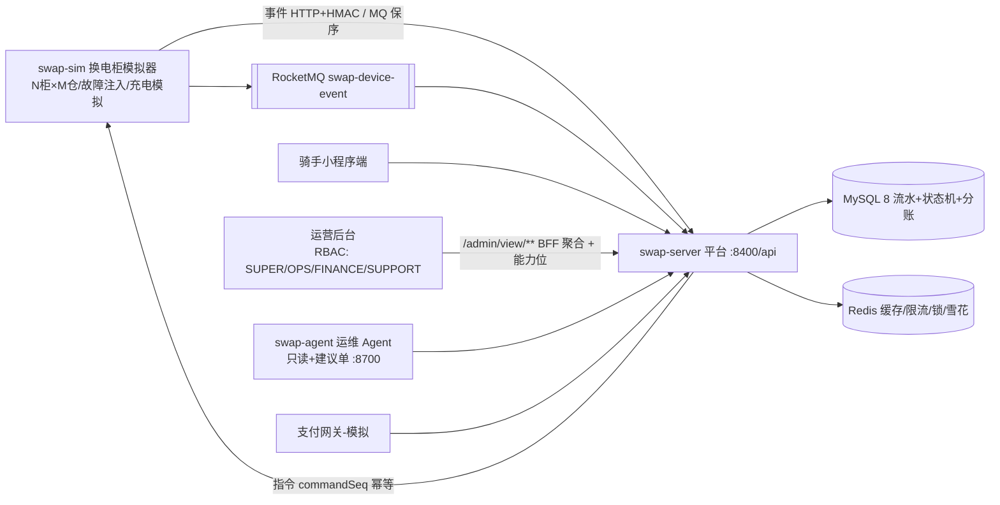

# battery-swap-ops

两轮电动车换电柜运营平台（样例工程）：**从"设备可靠接入"到"设备经营"**——单城市多站点换电网络，
覆盖设备接入、换电订单闭环、可靠性工程与运营调度。

> 设计文档：`document/plans/`（S0 设计冻结全集）；架构详见 `document/knowledge/architecture.md`；
> 运行详见 `document/knowledge/runbook.md`；剧本索引 `scripts/verify/README.md`。
> 阶段计划见工作区 `项目一-阶段计划.md`；参考基准见工作区 `项目一-参考基准.md`。

## 现状（2026-09-19）

- 阶段：S0 设计冻结 ✅ / S1 指令闭环 ✅ / S2 换电闭环 ✅ / S3 可靠性深水 ✅ / S4 运营调度 ✅ /
  S5 质量与云交付 ✅ / S7 运营纵深 ✅（管理端 RBAC+审计 / 渠道对账 T+1 / 用户服务与营销 / 代理分润结算 / 韧性补丁）/
  **S6 运维 Agent 最小版 ✅**（独立 `swap-agent`：只读诊断 + 建议单闭环 + 评测集 20 题 + 反向断言）/
  **S8 前端管理台与 BFF 视图层 🔄**（批次29 后端地基已完成：`auth/me` + 能力位 + 7 个 `/admin/view/**` 聚合 + 工单站点归属；前端工程 `swap-web` 批次30 开工）
- 测试：**473/473**（契约 4 + 平台 409 + 模拟器 31 + Agent 29）；JaCoCo 门槛 server 65% / sim 55% / contract 70% / agent 65%，CI `mvn verify` 强制（实测 server 71.5% / agent 86.2%）
- 对账不变量 **14 组**（含分账守恒/结算单一致/完成单必分账/欠费/券状态）；任务看护 9 项
- 容量（读路径方法论复测，512m 堆，限流关，同机）：**3,230/s @20 线程 / 3,526/s @100 线程，0 错误，p99 16ms/84ms**（预热+稳态窗口；旧 465.5/s 为压测端端口耗尽假象，见 `document/knowledge/capacity-model.md`）
- 实机剧本 36 个（`scripts/verify/README.md` 总索引；batch1-29 全 PASS，含双实例 `_c29`、异构设备端 `_c30`、运维 Agent `_c31`、BFF 视图与数据权限 `_c32`）

## 架构



可靠性组件：MQ 保序消费 / 幂等双线 / 定时对账（14 组不变量）/ 任务看护（9 任务）/ outbox / 延迟任务 /
限流 / 熔断舱壁 / 两级缓存 / 支付终态仲裁 / **计费硬失败欠费化（事件不回滚）**。
经营组件：**代理分润结算（append-only 分账+退款冲正）** / **渠道对账 T+1（四类差异+处置）** /
**用户服务（报障→工单 / 欠费闭环 / 优惠券 / 站内信）** / 工单 SLA / 看板 / 调拨 / 充电策略 / Agent 接缝。
前端接入层（S8）：**BFF 视图层 `web/view`**（一页一请求的只读聚合 + `allowedActions` 能力位 + VO 不出 Entity/不泄密钥）、
`GET /admin/auth/me`（角色+37 权限码+数据范围）、权限码前后端一致性门禁（`PermissionCodeContractTest`）。
详见 `document/knowledge/architecture.md`。

## 模块

| 模块 | 说明 | 端口 |
|---|---|---|
| `swap-contract` | 双端契约：枚举 / HMAC canonical / 契约向量测试 | — |
| `swap-server` | 换电运营平台（设备接入 + 业务，context-path `/api`） | 8400 |
| `swap-sim` | 换电柜模拟器（N 柜 × M 仓，心跳/事件/故障注入） | 8500 |
| `swap-agent` | 运维 Agent（只读诊断 + 建议单；零依赖外部消费者） | 8700 |
| `swap-web` | 前端管理台（Vue 3 + Vite + TS + Element Plus；批次30 开工，见 `document/plans/S8-*.md`） | dev 5173 |

技术栈：Java 17 / Spring Boot 3.5 / MyBatis-Plus / MySQL 8 / Redis / RocketMQ / JMeter（容量）。

## 快速开始（本地，Windows PowerShell 5.1）

```powershell
# 1) 中间件：MySQL 3306(root/root)；Redis（--dir F:\Redis 保证 RDB 可写）；
#    RocketMQ namesrv 9876 + broker 10911 + proxy 8081（.local/start-broker-proxy.bat）
#    有 Docker 的机器可跳过本节：docker compose -f docker-compose.middleware.yml up -d（仅 MySQL+Redis）

# 2) 建库建表（幂等，db/00-17 共 18 个迁移脚本，按序执行）
mysql -uroot -proot < db/00-create-database.sql
mysql -uroot -proot < db/01-swap-schema.sql
# ... db/02-s2-migration.sql ~ db/17-work-order-scope.sql 依次执行

# 3) 密钥零明文：SWAP_DEV_SECRET / SWAP_ADMIN_TOKEN / SWAP_PAY_SECRET（.local/*.txt，gitignored）

# 4) 打包并启动（或 .local/run-server.bat / run-sim-dual.bat）
mvn -B -ntp package
.local\run-server.bat
.local\run-sim-dual.bat

# 5) 剧本 1（开仓闭环）
powershell -File scripts/verify/batch1/_g1_open_loop.ps1
```

运行模式与通道矩阵（fast 模式 / load 模式 / http|mq|dual 取舍）：`document/knowledge/runbook.md`。

## 演示与复现（P0-4）

```powershell
# 一键演示：换电全链路（TAKE/SWAP/RETURN）+ 管理端对账（break-glass）+ OpenAPI 导出
powershell -File scripts/demo/_p0_demo.ps1        # 证据：scripts/demo/_p0_demo_out.txt

# 第三方契约客户端（Python 标准库手写 HMAC，验证协议可被非 Java 端实现）
python scripts/verify/batch15/_py_contract_client.py   # 运行后建议重启 sim（更换代际）

# OpenAPI 文档页（本地）：http://127.0.0.1:8400/api/swagger-ui.html
# 离线快照：document/api/openapi.json；HTTP 请求集：scripts/demo/battery-swap-ops.http
```

## 契约（v1）

- 事件：`POST /api/device/event`（HMAC `X-Device-Sign`，canonical `cabinetNo|eventType|cellNo|batteryNo|bootId|eventSeq`）
- 心跳：`POST /api/device/heartbeat`（恒 HTTP；判活不依赖消息中间件）
- 指令：`POST /cmd`（平台→柜，同步回执；`commandSeq` 幂等）
- 协议全文：`document/plans/S0.3-设备协议v1.md`；测试向量：`swap-contract` 契约测试

## 测试与质量

```powershell
mvn -B -ntp clean test                              # 全量单测（本地全绿基线，clean 必须）
mvn -B -ntp test "-Dsurefire.runOrder=random"       # push 前随机顺序复跑（防 MP lambda 静态缓存假绿）
mvn -B -ntp clean verify                            # 覆盖率门槛（CI 同款）
```

- 实机剧本 36 个（`scripts/verify/`，全 PASS）；容量与 GC 证据在 `batch7/`（jtl/GC 原件归档 `diag-archive/`，不入 git）
- CI：`.github/workflows/ci.yml`（build → test → coverage summary，每 push 收口）

## 文档地图

| 位置 | 内容 |
|---|---|
| `document/plans/` | S0 设计冻结 + S3 可靠性方案 + S7 运营纵深 + S8 前端与 BFF 视图层 |
| `document/block-records/` | 批次 1-27、29 实施记录（做了什么/取舍/验证证据；28 为 Agent 智能化设计，未开工） |
| `document/pitfalls/` `fixes/` | 踩坑与修复（环境/编码/并发/JVM） |
| `document/knowledge/` | 领域知识（含 architecture / runbook / s5-quality-delivery） |
| `scripts/verify/` | 剧本与证据（README 为总索引） |
