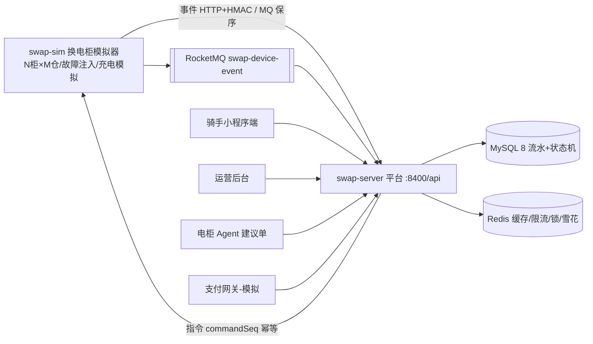

# battery-swap-ops

两轮电动车换电柜运营平台（样例工程）：**从"设备可靠接入"到"设备经营"**——单城市多站点换电网络，
覆盖设备接入、换电订单闭环、可靠性工程与运营调度。

> 设计文档：`document/plans/`（S0 设计冻结全集）；架构详见 `document/knowledge/architecture.md`；
> 运行详见 `document/knowledge/runbook.md`；剧本索引 `scripts/verify/README.md`。
> 阶段计划见工作区 `项目一-阶段计划.md`；参考基准见工作区 `项目一-参考基准.md`。

## 现状（2026-09-14）

- 阶段：S0 设计冻结 ✅ / S1 指令闭环 ✅ / S2 换电闭环 ✅ / S3 可靠性深水 ✅ / S4 运营调度 ✅ / S5 质量交付（进行中：覆盖率门槛+压测+GC 已完成，文档收口+云部署待做）
- 测试：**294/294**（契约 4 + 平台 262 + 模拟器 28）；JaCoCo 门槛 server 65% / sim 55% / contract 70%（实测 69.0 / 61.1 / 77.2），CI `mvn verify` 强制
- 容量（读路径，512m 堆，限流关）：**465.5/s**、0 错误、p95 11ms / p99 14ms；GC 16 次 / 总暂停 68.5ms / 最大 9.9ms（证据 `scripts/verify/batch7/`）

## 架构



可靠性组件：MQ 并发度=1 保序消费 / 幂等双线（`(bootId,eventSeq)` 序守卫 + `commandSeq` 已受理/已被拒）/
定时对账（9 组不变量）/ 任务看护（8 个任务停摆告警）/ outbox 事务消息 / 延迟任务 / 令牌桶限流 / 熔断舱壁 /
两级缓存 / 支付终态仲裁。详见 `document/knowledge/architecture.md`。

## 模块

| 模块 | 说明 | 端口 |
|---|---|---|
| `swap-contract` | 双端契约：枚举 / HMAC canonical / 契约向量测试 | — |
| `swap-server` | 换电运营平台（设备接入 + 业务，context-path `/api`） | 8400 |
| `swap-sim` | 换电柜模拟器（N 柜 × M 仓，心跳/事件/故障注入） | 8500 |

技术栈：Java 17 / Spring Boot 3.5 / MyBatis-Plus / MySQL 8 / Redis / RocketMQ / JMeter（容量）。

## 快速开始（本地，Windows PowerShell 5.1）

```powershell
# 1) 中间件：MySQL 3306(root/root)；Redis（--dir F:\Redis 保证 RDB 可写）；
#    RocketMQ namesrv 9876 + broker 10911 + proxy 8081（.local/start-broker-proxy.bat）

# 2) 建库建表（幂等，全量迁移 db/00-09 依次执行）
mysql -uroot -proot < db/00-create-database.sql
mysql -uroot -proot < db/01-swap-schema.sql
mysql -uroot -proot < db/02-s2-migration.sql
# ... db/03-s3-payment.sql ~ db/09-agent-action.sql 依次执行

# 3) 密钥零明文：SWAP_DEV_SECRET / SWAP_ADMIN_TOKEN / SWAP_PAY_SECRET（.local/*.txt，gitignored）

# 4) 打包并启动（或 .local/run-server.bat / run-sim-dual.bat）
mvn -B -ntp package
.local\run-server.bat
.local\run-sim-dual.bat

# 5) 剧本 1（开仓闭环）
powershell -File scripts/verify/batch1/_g1_open_loop.ps1
```

运行模式与通道矩阵（fast 模式 / load 模式 / http|mq|dual 取舍）：`document/knowledge/runbook.md`。

## 契约（v1）

- 事件：`POST /api/device/event`（HMAC `X-Device-Sign`，canonical `cabinetNo|eventType|cellNo|batteryNo|bootId|eventSeq`）
- 心跳：`POST /api/device/heartbeat`（恒 HTTP；判活不依赖消息中间件）
- 指令：`POST /cmd`（平台→柜，同步回执；`commandSeq` 幂等）
- 协议全文：`document/plans/S0.3-设备协议v1.md`；测试向量：`swap-contract` 契约测试

## 测试与质量

```powershell
mvn -B -ntp clean test                              # 全量单测（本地全绿基线，clean 必须）
mvn -B -ntp test "-Dsurefire.runOrder=random"       # push 前随机顺序复跑（防 MP lambda 静态缓存假绿）
mvn -B -ntp clean verify                            # 覆盖率门槛（CI 同款）
```

- 实机剧本 19 个（`scripts/verify/`，全 PASS）；容量与 GC 证据在 `batch7/`（jtl/GC 原件归档 `diag-archive/`，不入 git）
- CI：`.github/workflows/ci.yml`（build → test → coverage summary，每 push 收口）

## 文档地图

| 位置 | 内容 |
|---|---|
| `document/plans/` | S0 设计冻结 + S3 可靠性方案 |
| `document/block-records/` | 批次 1-7 实施记录（做了什么/取舍/验证证据） |
| `document/pitfalls/` `fixes/` | 踩坑与修复（环境/编码/并发/JVM） |
| `document/knowledge/` | 领域知识（含 architecture / runbook / s5-quality-delivery） |
| `scripts/verify/` | 剧本与证据（README 为总索引） |
