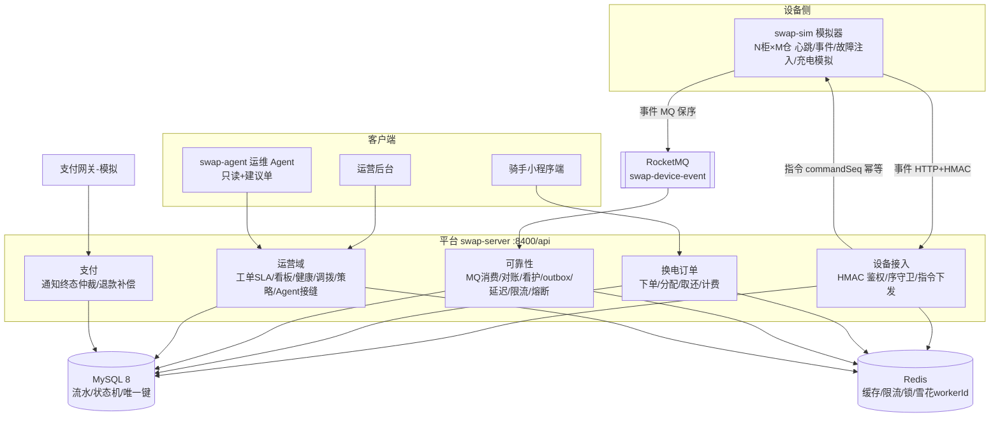

# 架构说明（battery-swap-ops）

> 面向面试/交接的架构全景。领域模型与状态机细节见 `plans/S0.1-领域模型.md`、`plans/S0.2-状态机.md`。
> 每个组件的深层知识见同目录专题档（outbox-pattern / payment-terminal-arbitration / circuit-breaker-bulkhead 等）。

## 1. 总览

## 2. 设备接入链（S1）

- **心跳**：恒 HTTP `POST /api/device/heartbeat`——判活不依赖消息中间件；超时由 offline-scan 标记离线并告警。
- **事件**：`POST /api/device/event`，HMAC-SHA256 签名（canonical 字符串 `cabinetNo|eventType|...`，密钥仅环境变量）。
- **幂等双线**：事件用 `(bootId,eventSeq)` 序守卫（条件 UPDATE 原子守卫）；指令用 `commandSeq` 双线（已受理/已被拒）。
- **指令**：`POST /cmd` 同步回执；超时由 monitor-reconcile 对账（QUERY_STATE 反查设备证据 → 销账或重试；策略指令走 reapply 同版本幂等）。
- **MQ（S3.5）**：并发度=1 保序、毒消息分级 ack/重投、死信、traceId 透传；HTTP 恒为兜底通道。

## 3. 换电闭环（S2）

订单状态机：`PENDING_OPEN → OPENED → TAKEN → COMPLETED`（OVERDUE / TIMEOUT_CLOSED / CANCELLED / EXCEPTION 旁路；
枚举以 `swap-contract` 的 OrderStatus 为准，见 S0.2）。
分配=Redis LUA 弹仓 + 单条条件 UPDATE 原子占仓兜底；计费=套餐扣次优先 → 余额单次费（券抵扣）→ 超时按小时加收（硬失败欠费化）；
资金幂等靠 `pay_order.trade_no` / `refund_record.refund_no` 唯一键 + CAS 终态跃迁 + `payment_record(order_id,payment_type)` 幂等闸（回调响应脱敏）。

## 4. 可靠性组件（S3）

| 组件 | 机制 | 文档 |
|---|---|---|
| MQ 保序消费 | 并发度=1、毒消息分级、死信、懒重建 | outbox-pattern / 契约 §7 |
| 定时对账 | 14 组不变量（订单/资产/持有者/调拨台账/Agent 悬挂/分账守恒/结算单/欠费/券/计数/老化指令等） | charge-policy / transfer / agent-seam |
| 任务看护 | 9 个任务 beat 登记 + 停摆告警（心跳仍存活时的任务假死检测） | s5-quality-delivery |
| outbox 事务消息 | 本地表 + 5s 轮询中继，接入顺延不丢事 | outbox-pattern |
| 延迟任务 | DB 调度表 + 秒级轮询分发（默认 1s，fast 剧本 500ms） | payment-terminal-arbitration |
| 限流 | 注解 + Redis 令牌桶（关=注解失效，load 模式用） | rate-limit-token-bucket |
| 熔断/舱壁 | Resilience4j 按通道隔离 | circuit-breaker-bulkhead |
| 缓存 | L1 Caffeine + L2 Redis 两级 | two-level-cache |
| ID | Snowflake（workerId Redis 预约，-1 自动编号） | snowflake-id-and-clock-rollback |
| 优雅停机 | 停流量→排空→关线程池→关连接 | 批次4 记录 |

## 5. 运营域（S4 + S7）

- **工单 SLA**：告警→派单→处理→关闭；高中低优先级 SLA 时限；自动关闭/超时升级（work-order-sla）。
- **看板**：站点/柜/仓/电池视图 + 三指标聚合（L2 缓存 60s，dashboard-metrics）。
- **电池健康**：循环计数以"服务循环"计、标称"BMS 等效循环"（口径声明在 battery-health）。
- **调拨**：站点间电池级调拨——启发式供需（富余/缺口阈值）→ 建议 → 审批 → 出库/入库（明细 CAS 聚合推进）→ 对账不变量⑧（transfer）。
- **充电策略**：单价+峰谷价差，柜侧单调应用、版本单调递增、可回滚（charge-policy）。
- **Agent 接缝**：建议单（PROPOSED→APPROVED→EXECUTING→CONFIRMED/REJECTED），建议与确认可异步 CAS（agent-seam）。
- **管理端身份与审计（S7 WP-A）**：RBAC（SUPER/OPS/FINANCE/SUPPORT × 37 权限码）方法级鉴权 +
  admin_op_log 操作审计 + break-glass 静态 token（rbac-and-audit）。
- **渠道对账 T+1（S7 WP-C）**：账单导入（幂等覆盖）→ 四类差异重建（HANDLED 留痕）→ 处置 + 日任务 + 告警（channel-recon）。
- **用户服务与营销（S7 WP-D）**：报障→工单（去重+未关单复核）/ 欠费闭环（门槛+补缴/减免）/ 优惠券状态机
  （发→锁→核销/4 路径释放）/ 站内信（user-service-and-coupon）。
- **代理分润结算（S7 WP-B）**：站点归属代理 → 完成单 append-only 分账（CASH/次卡折算/月卡口径）→
  退款负向冲正、欠费补缴补行 → 顺序批结算单（PAID 不可变）→ 报表（agent-settlement）。

## 6. 安全与资金边界

- 密钥零明文：环境变量注入，响应脱敏（含柜密钥分页脱敏），日志无密钥；管理接口会话 token + break-glass。
- 身份分层：**三面隔离**——设备面（per-柜 HMAC）/ 用户面（X-User-Token 会话）/ 管理面（会话 + RBAC 权限码）；
  **管理员内部分层（RBAC）已落地**（S7 WP-A）；**数据权限（DataFilter 按网点隔离）已落地**（P1-8，批次22：六类列表过滤 + 资源级 403 + fail-closed）。
- 资金链路：无缓存、无 Agent 直连路径；改动唯一入口是流水+状态机；
  **计费硬失败不改写设备事实**（欠费化，G1 韧性补丁）。

## 7. 部署形态

- 本地：Windows 单机全栈（MySQL/Redis/RocketMQ + server/sim 各一进程，详见 runbook）。
- **多实例形态（P0-2，2026-09-17 已演练）**：同库同 Redis 多 server 实例——定时任务由 `JobLockService`
  租约互斥；延迟任务由 ZREM 原子领取；Snowflake workerId 走 Redis 租约（owner=ip:port，启动期领取）；
  MQ 消费同一 consumer group 由 broker 侧负载均衡。30 分钟双实例演练：零重复执行（每笔订单只在
  一个实例关闭一次）、终局对账 total=0、无锁雪崩（`scripts/verify/batch24/_c29_out.txt`）。
- **MQ 事件通道（P0-2 终态）**：`swap-device-event` 为 FIFO topic，发送端按 `messageGroup=cabinetNo`
  设组（同柜同队列、严格投递序）；**服务端只保投递序、不 hold 未 ack 的同柜后续**（spike 实测）——
  柜内串行由消费端分片保证（`receive(batch=16, invisible=30s)` 按柜 hash 到 4 workers：同柜串行、跨柜并行），
  保序不变量为"每柜单调"（序守卫本就按柜判定，业务语义不变）；HTTP 通道保留为降级形态。
- 云端（2026-09-14 起）：`/opt/swap` jar + systemd 双服务（swap-server :8400 / swap-sim :8500），
  HTTP 事件通道（未装 RocketMQ），密钥在 `/opt/swap/config/swap.env`（600），每日备份 cron + 恢复演练；
  暴露面仅 SSH（ufw 仅 22）。见《服务器连接文档》§九与 runbook §9。
- **运维 Agent（S6，2026-09-17）**：`swap-agent` 独立进程 :8700（本地 `.local/start-agent.ps1`）——只读消费管理端接口 +
  仅“建议单”写入（propose 零副作用，人工 confirm 才执行）；平台对 Agent 零依赖（杀进程后平台健康/设备心跳/告警记录
  三路实证不受影响，`scripts/verify/batch27/_c31_out.txt`）。云端可按需追加 systemd 服务。
- **前端接入层（S8，2026-09-19）**：BFF 视图层 `com.swapops.server.web.view`（**同进程，不独立成服务**——
  单消费方场景下独立 BFF 的收益不兑现，取舍已申报见 `plans/S8-前端管理台与BFF视图层-方案.md` §4.1）：
  `/admin/view/**` 7 个只读聚合端点（一页一请求，批量查询防 N+1）+ `allowedActions` 能力位
  （`common/action/ActionsSupport` 纯函数，前端不复制状态机）+ VO 化（不出 Entity；柜 VO 无 `secret`；
  可退金额取服务端资金口径）；`GET /admin/auth/me` 下发角色/37 权限码/数据范围；权限码前后端一致性由
  `PermissionCodeContractTest` 在 CI 把关。工单新增 `station_id`（db/17，创建时由 `DeviceOwnershipService` 按设备解析）
  使工单纳入站点数据范围；`alarm`/`agent_action` 无站点归属列，为全局口径资源（有意不挂 `@DataFilter`）。
  前端工程 `swap-web`（Vue 3 + Vite + TS + Element Plus + Pinia，**批次30 已落地**：登录/看板/告警与建议单 +
  路由 `meta.codes` 守卫 + `v-access` 按钮级；菜单由路由表派生；门禁 `vue-tsc --noEmit` + `vite build`，CI `frontend` job）；
  开发期 Vite proxy :5173→:8400、生产 nginx 同源反代 `/api`（后端不开 CORS）。
- **持久层拦截器（S8 批次30 补，2026-09-19）**：`config/MybatisPlusConfig` 注册 `PaginationInnerInterceptor`
  （MySQL 方言、`maxLimit = PageParams.MAX_LIMIT = 200`、`overflow=false` 使页码越界返回空而非静默回首页）
  + `BlockAttackInnerInterceptor`（已核实全仓 update/delete 均带 where，只拦事故不拦业务）。
  **此前该配置类不存在**，导致全部 13 个分页端点的 `selectPage` 静默退化为全表查询且 `total` 恒为 0
  （`admin_op_log` 单次请求序列化 21491 行、`swap_order` 5842 行），且不抛异常、HTTP 照常 200——
  单测（mock `selectPage`）、剧本（只断言 `code=0` 与业务值）、SpotBugs、jacoco **四层防线全部抓不到**，
  最终由前端浏览器实机联调暴露。回归网两层：`MybatisPlusConfigTest`（不依赖 DB，CI 内可挡回归）
  + `scripts/verify/batch30/_c33_paging.ps1`（13 端点 × 5 类断言）。详见 `pitfalls/mp-pagination-interceptor-missing.md`。
