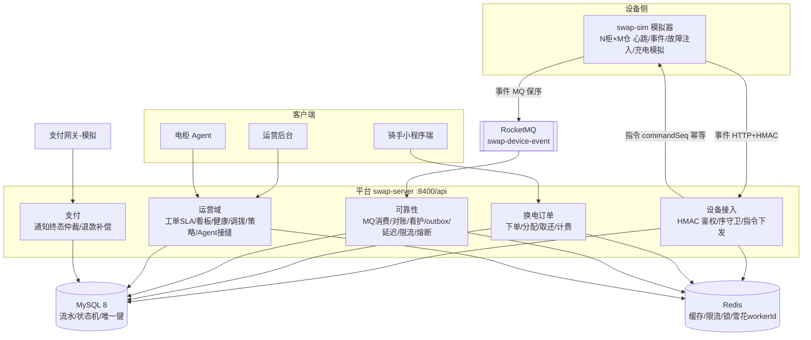

# 架构说明（battery-swap-ops）

> 面向面试/交接的架构全景。领域模型与状态机细节见 `plans/S0.1-领域模型.md`、`plans/S0.2-状态机.md`。
> 每个组件的深层知识见同目录专题档（outbox-pattern / payment-terminal-arbitration / circuit-breaker-bulkhead 等）。

## 1. 总览

## 2. 设备接入链（S1）

- **心跳**：恒 HTTP `POST /api/device/heartbeat`——判活不依赖消息中间件；超时由 offline-scan 标记离线并告警。
- **事件**：`POST /api/device/event`，HMAC-SHA256 签名（canonical 字符串 `cabinetNo|eventType|...`，密钥仅环境变量）。
- **幂等双线**：事件用 `(bootId,eventSeq)` 序守卫（条件 UPDATE 原子守卫）；指令用 `commandSeq` 双线（已受理/已被拒）。
- **指令**：`POST /cmd` 同步回执；超时由 monitor-reconcile 对账（QUERY_STATE 反查设备证据 → 销账或重试；策略指令走 reapply 同版本幂等）。
- **MQ（S3.5）**：并发度=1 保序、毒消息分级 ack/重投、死信、traceId 透传；HTTP 恒为兜底通道。

## 3. 换电闭环（S2）

订单状态机：`CREATED → PAID → PENDING_OPEN → OPENED → PENDING_CLOSE → COMPLETED`（取消/异常旁路）。
分配是"单条条件 UPDATE 原子占仓"；计费规则=按时长阶梯（套餐/单次/最低时长）；押金账本与余额支付为流水记账，
幂等靠 `payNotifyId` 唯一键 + 终态仲裁（响应脱敏，无明文回传）。

## 4. 可靠性组件（S3）

| 组件 | 机制 | 文档 |
|---|---|---|
| MQ 保序消费 | 并发度=1、毒消息分级、死信、懒重建 | outbox-pattern / 契约 §7 |
| 定时对账 | 9 组不变量（超时订单/分账/履约/老化指令/计数/调拨/Agent 悬挂…） | charge-policy / transfer / agent-seam |
| 任务看护 | 8 个任务 beat 登记 + 停摆告警（心跳仍存活时的任务假死检测） | s5-quality-delivery |
| outbox 事务消息 | 本地表 + 5s 轮询中继，接入顺延不丢事 | outbox-pattern |
| 延迟任务 | DB 调度表 + 500ms 轮询分发 | payment-terminal-arbitration |
| 限流 | 注解 + Redis 令牌桶（关=注解失效，load 模式用） | rate-limit-token-bucket |
| 熔断/舱壁 | Resilience4j 按通道隔离 | circuit-breaker-bulkhead |
| 缓存 | L1 Caffeine + L2 Redis 两级 | two-level-cache |
| ID | Snowflake（workerId Redis 预约，-1 自动编号） | snowflake-id-and-clock-rollback |
| 优雅停机 | 停流量→排空→关线程池→关连接 | 批次4 记录 |

## 5. 运营域（S4 + S7）

- **工单 SLA**：告警→派单→处理→关闭；高中低优先级 SLA 时限；自动关闭/超时升级（work-order-sla）。
- **看板**：站点/柜/仓/电池视图 + 30min 粒度聚合指标（dashboard-metrics）。
- **电池健康**：循环计数以"服务循环"计、标称"BMS 等效循环"（口径声明在 battery-health）。
- **调拨**：按"整柜转运"模型：批次→调度→理仓，可拆箱、防错箱错柜（transfer）。
- **充电策略**：单价+峰谷价差，柜侧单调应用、版本单调递增、可回滚（charge-policy）。
- **Agent 接缝**：建议单（PROPOSED→APPROVED→EXECUTING→CONFIRMED/REJECTED），建议与确认可异步 CAS（agent-seam）。
- **管理端身份与审计（S7 WP-A）**：RBAC（SUPER/OPS/FINANCE/SUPPORT × 38 权限码）方法级鉴权 +
  admin_op_log 操作审计 + break-glass 静态 token（rbac-and-audit）。
- **渠道对账 T+1（S7 WP-C）**：账单导入（幂等覆盖）→ 四类差异重建（HANDLED 留痕）→ 处置 + 日任务 + 告警（channel-recon）。
- **用户服务与营销（S7 WP-D）**：报障→工单（去重+未关单复核）/ 欠费闭环（门槛+补缴/减免）/ 优惠券状态机
  （发→锁→核销/4 路径释放）/ 站内信（user-service-and-coupon）。
- **代理分润结算（S7 WP-B）**：站点归属代理 → 完成单 append-only 分账（CASH/次卡折算/月卡口径）→
  退款负向冲正、欠费补缴补行 → 顺序批结算单（PAID 不可变）→ 报表（agent-settlement）。

## 6. 安全与资金边界

- 密钥零明文：环境变量注入，响应脱敏（含柜密钥分页脱敏），日志无密钥；管理接口会话 token + break-glass。
- 身份分层：**三面隔离**——设备面（per-柜 HMAC）/ 用户面（X-User-Token 会话）/ 管理面（会话 + RBAC 权限码）；
  **管理员内部分层（RBAC）已落地**（S7 WP-A）；数据权限（按网点过滤，DataFilter 模式）仍未做，声明后置。
- 资金链路：无缓存、无 Agent 直连路径；改动唯一入口是流水+状态机；
  **计费硬失败不改写设备事实**（欠费化，G1 韧性补丁）。

## 7. 部署形态

- 当前：Windows 单机全栈（MySQL/Redis/RocketMQ + server/sim 各一进程，详见 runbook）。
- 云部署：待定（jar+systemd 或 Docker、端口/HTTPS 口径待拍板），占位见 runbook §9。
