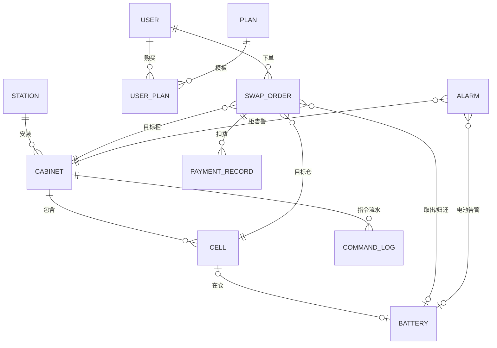

# S0.1 领域模型（battery-swap-ops）

> 阶段：S0 设计冻结 · 第 1 小阶段 ｜ 状态：**待评审**（通过后进 S0.2 状态机）
> 口径：两轮电动车换电；单城市、多站点（10~15 站 × 2 柜 × 12 仓）；设备建模=专用模型；
> 传输=范例 A（心跳 HTTP + 事件 MQ + 下行 HTTP 同步应答）。
> 已确认默认：计费=套餐次数+超时费+押金；支付=虚拟钱包/模拟回调；前端 P0 不做；模拟器独立进程。
> 参考：`项目一-参考基准.md`（本文 §7 逐条引用）；上位：`项目一-换电运营平台-设计备忘.md`、`项目一-阶段计划.md`。
> 日期：2026-09-11

---

## 0. 本文范围

- **产出**：实体清单（五域）+ 实体关系 + 关键业务规则（不变量）+ 并发语义；
- **不含**：状态机细节（S0.2）、设备协议（S0.3）、API（S0.4）、字段级 DDL 与索引（S0.5）。

## 1. 业务全景

**一句话**：骑手扫码 → 平台分配"满电电池 + 可用仓"并开仓 → 用户取满电电池、把亏电电池还入同仓 → 关仓事件到达 → 订单完成（套餐扣次/计费）。

**角色**：换电用户（骑手为主、居民少量）、运营人员、运维人员、设备（换电柜）。

**业务基调**：
- 电池是**流动资产**——随用户在站点间流动，平台必须追踪"电池在哪（仓/用户手中）"，供需失衡由调拨解决（P2）；
- **事件是唯一事实源**（沿用范例铁律）：柜/仓/电池状态只能由设备事件推进，平台不替设备"猜"状态；
- 换电是**钱的操作**：指令幂等、事件对账、计费幂等一个都不能少。

## 2. 领域划分与实体清单

### 2.1 设备域（Device）

| 实体 | 说明 | 关键字段（业务级） |
|---|---|---|
| **Station 站点** | 换电柜的物理安装点 | stationNo（唯一）、name、address、status（运营/停用）、cityCode（预留） |
| **Cabinet 换电柜** | 接入平台的设备实例（设备台账） | cabinetNo（设备编号，唯一）、stationId、cellCount、status（在线/离线/维护/停用）、lastHeartbeatTime、lastBootId、lastEventSeq |
| **Cell 仓（槽位）** | 柜内电池槽 | cabinetId、cellNo（柜内编号）、status（空闲/占用/充电中/满电待换/故障/停用）、batteryId（当前电池，可空） |

> Cabinet 的 lastBootId/lastEventSeq 是范例序守卫在换电域的落点；心跳判活用 TTL（与 online key 同源）。

### 2.2 资产域（Asset）

| 实体 | 说明 | 关键字段（业务级） |
|---|---|---|
| **Battery 电池** | 平台资产，随用户流通 | batteryNo（SN，唯一）、model、status（在仓充电/满电待换/借出/维修/退役）、soc（0-100）、soh（简化指标）、cycleCount、cellId（当前所在仓，可空）、holderUserId（借出持有人，可空） |

> 电池状态与位置强相关：在仓（cellId 非空）↔ 借出（holderUserId 非空）；两字段互斥且分别唯一（见 §5/§6）。

### 2.3 用户域（User）

| 实体 | 说明 | 关键字段（业务级） |
|---|---|---|
| **User 用户** | 换电用户 | phone（唯一）、status（正常/冻结）、depositFen（押金）、realNameStatus（P0 可空） |
| **Plan 套餐模板** | 运营配置 | name、type（TIMES 次卡 / MONTHLY 月卡）、priceFen、totalTimes / durationDays、dailyLimitTimes（可空）、status |
| **UserPlan 用户套餐** | 购买后的权益 | userId、planId、startTime、endTime、remainingTimes（次卡）、status（生效/过期/退订/用完） |
| **Wallet 钱包** | 余额与押金账户（或并入 User，S0.5 定） | userId、balanceFen、frozenFen |

### 2.4 交易域（Trade）

| 实体 | 说明 | 关键字段（业务级） |
|---|---|---|
| **SwapOrder 换电订单** | 一次换电闭环；三类：SWAP（换电，取+还）/ TAKE（首借，只取）/ RETURN（退租，只还） | orderNo（业务号，唯一）、type、userId、stationId、cabinetId、cellId、takeBatteryId、returnBatteryId、userPlanId、status、feeFen、payType（套餐扣次/余额/免费）、openCommandSeq、各阶段时间戳 |
| **CommandLog 指令流水** | 复用范例模式（PENDING/ARRIVED/SEND_FAILED/RETRY_EXCEEDED/SUPERSEDED） | cabinetNo、action（OPEN_CELL）、seq、status、retryCount、时间戳 |
| **PaymentRecord 扣费记录** | 套餐扣次/超时费/押金/充值 | userId、orderId（可空）、type、amountFen、status、channel（MOCK）、tradeNo（唯一） |
| **RefundRecord 退款记录**（P1） | 异常补偿 | paymentId、amountFen、reason、status |
| **BatteryLog 电池轨迹**（P1） | 流转追溯（跨站调拨/对账依据） | batteryId、fromCell/toCell、userId、eventType、eventTime |

### 2.5 运营域（Ops）

| 实体 | 说明 | 关键字段（业务级） |
|---|---|---|
| **Alarm 告警** | 复用范例治理（去重/限速/合并/恢复） | deviceType（CABINET/BATTERY）、deviceNo、type、content、handled、handler |
| **WorkOrder 工单**（P2） | 告警 → 工单闭环 | alarmId（可空）、stationId/cabinetId、type、status、assignee、content |
| **TransferTask 调拨任务**（P2） | 站间电池调拨 | fromStationId、toStationId、items（电池清单）、status、createTime |
| **DeviceEventLog 事件流水**（可选） | 报文级追溯/对账 | cabinetNo、eventType、bootId、eventSeq、payload、eventTime |

## 3. 实体关系

关系要点：
- 站点 → 柜 → 仓 三级从属，仓是最小设备单元；
- 电池"任一时刻至多属于一个仓或一个用户"——由 Cell↔Battery 与 Battery.holderUserId 表达；
- 订单引用"目标柜/目标仓 + 取出电池 + 归还电池"四个设备侧对象，是设备事件与业务对账的锚点。

## 4. 核心业务流（订单视角）

> 订单三类（S0.2 细化）：**SWAP** 换电（在持电池：取满电+还亏电）/ **TAKE** 首借（未在持：只取）/
> **RETURN** 退租（结束服务：只还）。用户"至多持一块电池"由唯一约束保证（INV-9）。

1. **下单**：校验资格（生效套餐/余额/押金/无进行中订单）→ 分配（SWAP/TAKE 配满电电池+占用仓；
   RETURN 配空闲仓）→ **预占** → 创建订单（待开仓）→ 下发开仓指令（带 seq）；
2. **开仓**：柜开门事件到达 → 按 seq 销账指令 → 订单推进"已开仓"；
3. **取电**（SWAP/TAKE）：电池取出事件到达 → 电池转"借出"、绑定用户、仓转空；
   - TAKE：取电即完成（扣次/计费）；
4. **还电**（SWAP/RETURN）：亏电电池入仓事件到达 → 电池归仓（唯一约束兜底）、转"充电中"；
   - SWAP：取+还齐备即完成；
   - RETURN：还电即完成（押金退还，模拟）；
5. **完成**：以电池事件为准（`DOOR_CLOSED` 仅审计）→ 扣次/计费（幂等）→ 释放预占；
6. **异常**：SWAP 取出后未归还（超时）→ 逾期占用（告警+费用策略，可继续归还）；事件缺失/乱序 →
   QUERY_STATE 对账（S3）；开仓失败 → 重试分层/换仓（S3）。

## 5. 关键业务规则（不变量）

| # | 规则 | 保障手段 |
|---|---|---|
| INV-1 | 一块电池任一时刻至多位于一个仓或一个用户手中 | DB 唯一约束（battery.cellId / holderUserId 互斥）+ 事件驱动写入 |
| INV-2 | 一个仓至多一块电池 | cell.batteryId 唯一 + 条件 UPDATE（空闲→占用） |
| INV-3 | 一个用户同一时刻至多一个进行中订单 | 活跃订单唯一（生成列/部分唯一或 Redis 锁 + DB 兜底，S0.5 定） |
| INV-4 | 同一订单只开一次仓 | 指令 seq 幂等 + 柜侧幂等双线（范例）+ 事件销账 |
| INV-5 | 设备状态（柜/仓/电池）只能由设备事件推进 | 单一写入路径（沿用范例铁律）；心跳仅做对账校正 |
| INV-6 | 满电电池才可被分配 | battery.status=满电待换 且 soc ≥ 阈值（默认 90，可配） |
| INV-7 | 计费幂等：同一订单同类型只扣一次 | PaymentRecord 唯一键（orderId+type） |
| INV-8 | 预占必须有超时释放 | 预占 TTL + 延迟任务释放（S3）；释放后仓/电池回到可分配池 |
| INV-9 | 一个用户至多持有 1 块电池 | `battery.holder_user_id` 唯一索引（C2） |

## 6. 并发语义（设计口径）

| # | 场景 | 方案 |
|---|---|---|
| 6.1 | **满电电池+仓位的热点争抢**（高峰多骑手同站同时下单） | Redis Lua 原子"挑选+预占"（per 柜/站；预占键 TTL=开仓超时）；DB 条件更新兜底（cell 空闲→预占、battery 满电→锁定）；冲突即换候选重试 |
| 6.2 | **开仓指令幂等** | 订单↔指令 seq 一对一（范例 nextSeq/幂等双线）；重复事件幂等吸收 |
| 6.3 | **订单/电池/仓状态推进** | 全部 CAS 条件 UPDATE（from 状态守卫），杜绝覆盖写 |
| 6.4 | **重放/乱序事件** | bootId/eventSeq 序守卫（范例）吸收；跨代际重放拒绝（范例加固） |
| 6.5 | **归还入仓竞态**（同电池两仓事件） | battery.cellId 唯一索引兜底 + 事件序守卫 |
| 6.6 | **超时三类** | 预占超时（未开仓）/ 开仓后未取 / 取后未还——统一延迟任务（S3），动作：释放/告警/计费 |
| 6.7 | **扣费竞态** | PaymentRecord 唯一键 + 订单终态 CAS |

## 7. 参考与取舍（引用《项目一-参考基准.md》）

| 设计点 | 参考 | 采用 / 裁剪 |
|---|---|---|
| 设备建模 | JetLinks 统一物模型；ThingsBoard 设备 vs 资产 | **采用思想**：柜=设备、电池=资产（可流通）；**裁剪**：专用模型，不做物模型引擎 |
| 业务对象清单 | 铁塔换电产品结构（柜/电池/APP/运营平台）；orise/100charge 的场站-设备-计费-订单四域 | **采用**：站点/柜/仓/电池/套餐/订单/告警对象集；**拒绝**：多租户、互联互通 |
| 订单交易语义 | OCPP 2.0.1 交易生命周期（注册/心跳/交易事件） | **采用概念**（S0.2 状态机细化）；传输不用其 WebSocket 体系 |
| 事件唯一事实源/序守卫 | 范例协议 v2 + 条件更新知识 | **直接复用**（INV-5/6.3/6.4） |
| 分配与预占 | 范例+抢票项目的 Redis Lua/条件更新经验；ThingsBoard 设备凭证缓存思路 | **采用**：Redis 原子预占 + DB 唯一约束兜底 |
| 电池全生命周期 | 铁塔锂电参数（BMS/循环次数/GPS） | **裁剪**：只保留 soc/soh/cycleCount 业务字段，不做电气模型 |

## 8. 待细化与待确认

- **S0.2**：电池 / 仓 / 柜 / 订单 / 调拨 / 工单 状态机（事件→状态迁移表）；
- **S0.5**：字段级 DDL、索引与约束（含 6.1/6.5 的唯一索引落法）；
- 默认口径（本文已按此写，如需调整请指出）：
  1. 换电物理流程 = 取满电 → 还亏电入**同一仓**（SWAP；另有 TAKE/RETURN 两类订单，S0.2）；
  2. 满电阈值 soc ≥ 90（可配）；
  3. 借出超时默认 24h（可配）→ 逾期占用（告警 + 费用/押金策略，仍可归还）；
  4. P0 资格 = 有效套餐或余额充足；押金仅首单/无套餐时校验。
